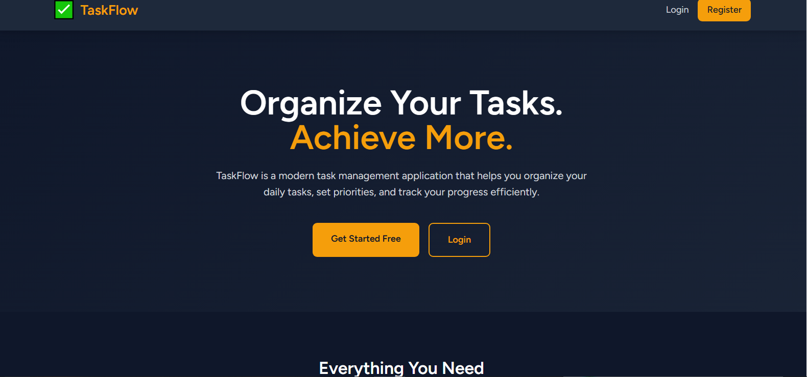
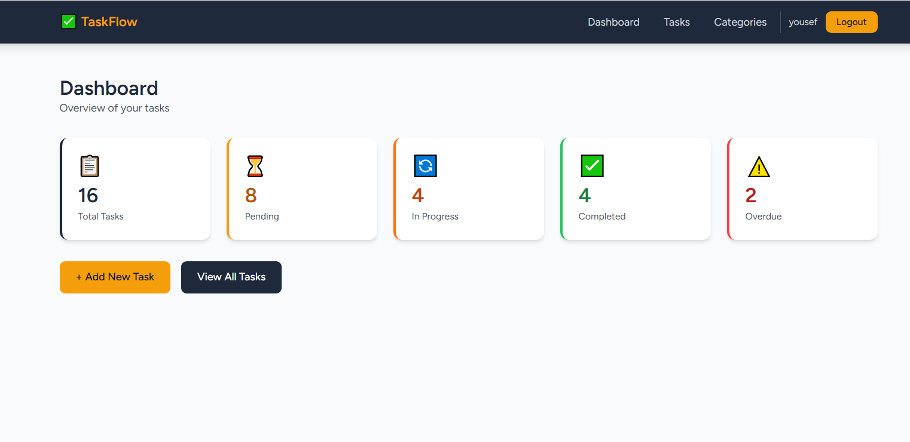
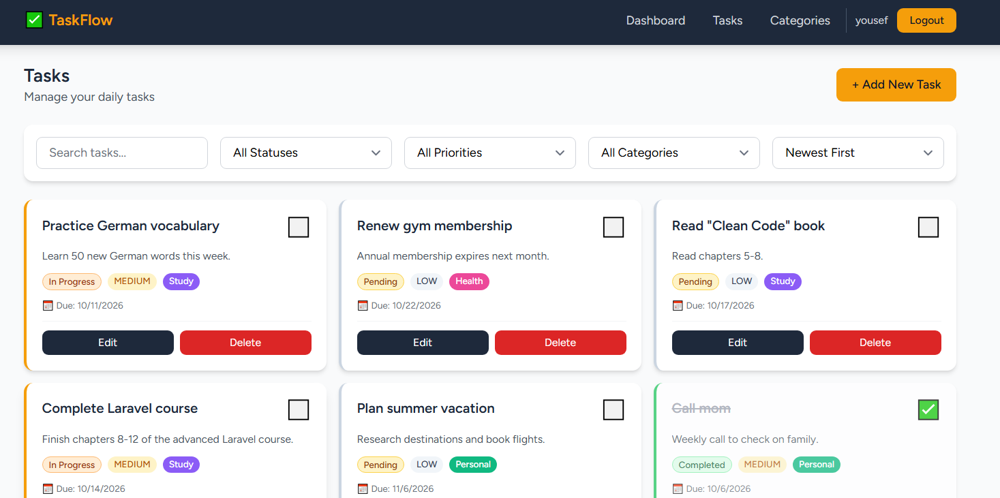
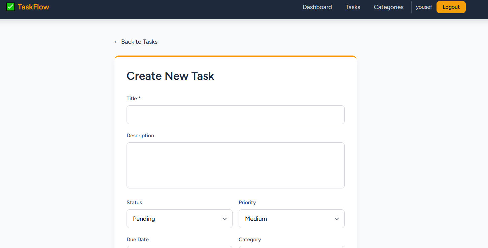
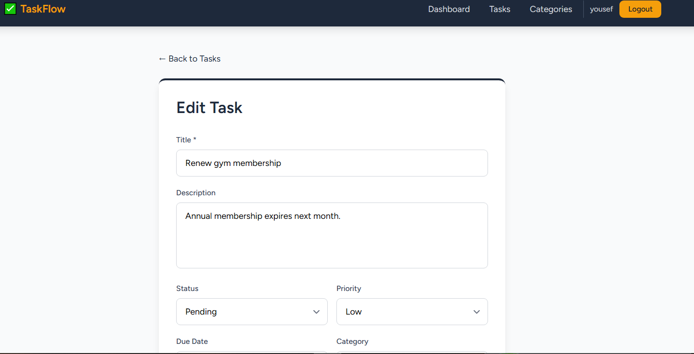
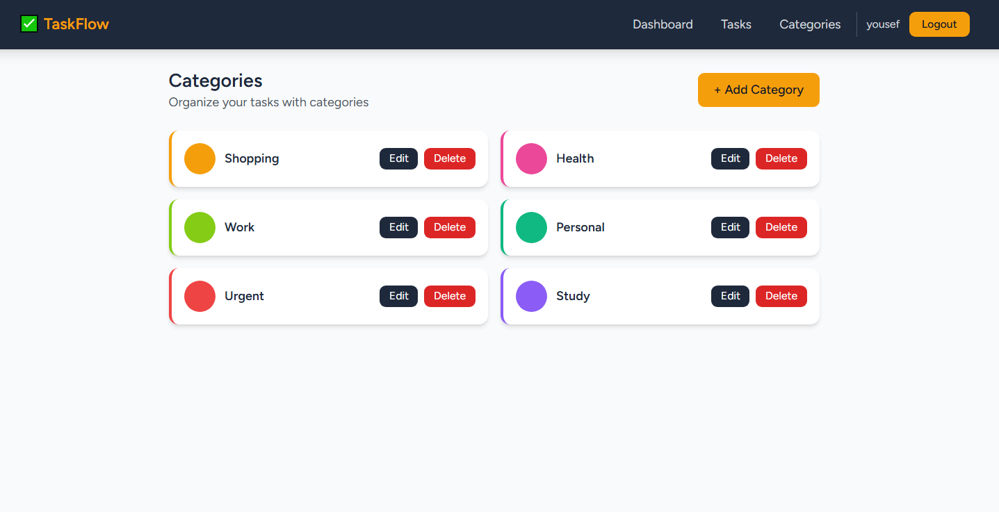
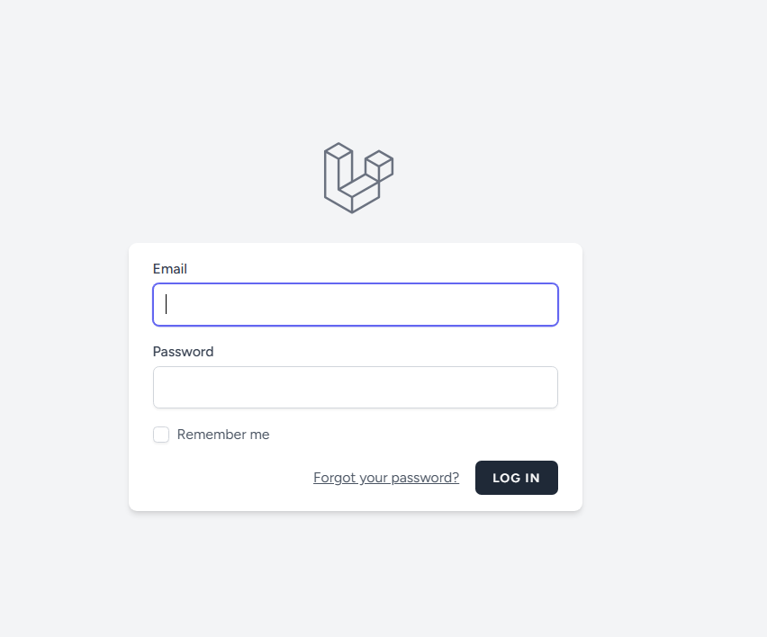
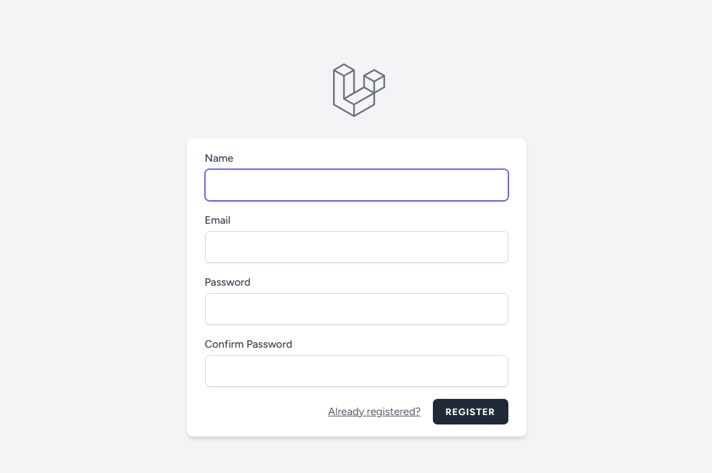

# ✅ TaskFlow

A modern, full-stack Task Management application built with **Laravel 11**, **React 18**, and **Inertia.js**. Designed with a professional dark UI (Navy + Amber) for productivity-focused users.

---

## 📋 Table of Contents

- [Features](#-features)
- [Tech Stack](#-tech-stack)
- [Installation](#-installation)
- [API Endpoints](#-api-endpoints)
- [Database Schema](#-database-schema)
- [Project Structure](#-project-structure)
- [Author](#-author)

---

## ✨ Features

### Core Features
- 🔐 **Authentication** — Register, Login, Logout (Laravel Breeze)
- 📝 **Full CRUD** for Tasks — Create, Read, Update, Delete
- 📁 **Categories** — Organize tasks with color-coded categories
- 🎯 **Priority Levels** — Low, Medium, High
- 📊 **Status Tracking** — Pending, In Progress, Completed
- 📅 **Due Dates** — Set deadlines with overdue detection
- ✅ **Quick Toggle** — Mark tasks as complete with one click

### Advanced Features
- 🔍 **Search** — Search tasks by title or description
- 🎛️ **Advanced Filtering** — Filter by status, priority, and category
- 🔀 **Sorting** — Sort by date, due date, or priority
- 📄 **Pagination** — Efficient handling of large task lists
- 📈 **Dashboard Statistics** — Real-time overview (total, pending, in progress, completed, overdue)
- 🎨 **Professional UI** — Navy + Amber color scheme, responsive design
- 🔒 **Secure API** — Protected routes with authentication middleware

---

## 🛠 Tech Stack

### Backend
- **Laravel 11** — PHP Framework
- **MySQL** — Database
- **Laravel Sanctum** — API Authentication (session-based)
- **Eloquent ORM** — Database interactions

### Frontend
- **React 18** — UI Library
- **Inertia.js** — SPA without API boilerplate
- **Tailwind CSS** — Utility-first styling
- **Vite** — Fast build tool
- **Axios** — HTTP client

## 🚀 Installation

### Prerequisites
- PHP >= 8.2
- Composer
- Node.js >= 18
- MySQL
- Git

### Step 1: Clone the repository

    git clone https://github.com/RaghadAli7/taskflow.git
    cd taskflow

### Step 2: Install PHP dependencies

    composer install

### Step 3: Install Node dependencies

    npm install

### Step 4: Configure environment

    cp .env.example .env
    php artisan key:generate

Edit `.env` and set your database credentials:

    DB_CONNECTION=mysql
    DB_HOST=127.0.0.1
    DB_PORT=3306
    DB_DATABASE=taskflow
    DB_USERNAME=root
    DB_PASSWORD=

### Step 5: Create database
Create a MySQL database named `taskflow` (via phpMyAdmin or CLI).

### Step 6: Run migrations

    php artisan migrate

### Step 7: Start the development servers

**Terminal 1 — Vite:**

    npm run dev

**Terminal 2 — Laravel:**

    php artisan serve

### Step 8: Open in browser

    http://127.0.0.1:8000

Register a new account and start managing your tasks! 🎉

## 🔌 API Endpoints

All endpoints require authentication.

### Categories

| Method | Endpoint | Description |
|--------|----------|-------------|
| GET | `/api/categories` | List all categories |
| POST | `/api/categories` | Create a new category |
| PUT | `/api/categories/{id}` | Update a category |
| DELETE | `/api/categories/{id}` | Delete a category |

### Tasks

| Method | Endpoint | Description |
|--------|----------|-------------|
| GET | `/api/tasks` | List tasks (with filters) |
| POST | `/api/tasks` | Create a new task |
| GET | `/api/tasks/{id}` | Get task details |
| PUT | `/api/tasks/{id}` | Update a task |
| DELETE | `/api/tasks/{id}` | Delete a task |
| PATCH | `/api/tasks/{id}/toggle-status` | Toggle task status |

### Statistics

| Method | Endpoint | Description |
|--------|----------|-------------|
| GET | `/api/stats` | Get dashboard statistics |

## 🗄 Database Schema

### `users`

| Column | Type | Notes |
|--------|------|-------|
| id | BIGINT | Primary key |
| name | VARCHAR | |
| email | VARCHAR | Unique |
| password | VARCHAR | Hashed |
| timestamps | | |

### `categories`

| Column | Type | Notes |
|--------|------|-------|
| id | BIGINT | Primary key |
| user_id | BIGINT | FK → users |
| name | VARCHAR | |
| color | VARCHAR | HEX color |
| timestamps | | |

### `tasks`

| Column | Type | Notes |
|--------|------|-------|
| id | BIGINT | Primary key |
| user_id | BIGINT | FK → users |
| category_id | BIGINT | FK → categories (nullable) |
| title | VARCHAR | |
| description | TEXT | Nullable |
| status | ENUM | pending, in_progress, completed |
| priority | ENUM | low, medium, high |
| due_date | DATE | Nullable |
| completed_at | TIMESTAMP | Nullable |
| timestamps | | |

---

## 📁 Project Structure

    taskflow/
    ├── app/
    │   ├── Http/
    │   │   └── Controllers/
    │   │       ├── Api/
    │   │       │   ├── CategoryController.php
    │   │       │   └── TaskController.php
    │   │       └── ProfileController.php
    │   └── Models/
    │       ├── Task.php
    │       ├── Category.php
    │       └── User.php
    ├── database/
    │   └── migrations/
    ├── resources/
    │   └── js/
    │       ├── Layouts/
    │       │   └── AuthenticatedLayout.jsx
    │       └── Pages/
    │           ├── Dashboard.jsx
    │           ├── Welcome.jsx
    │           ├── Tasks/
    │           │   ├── Index.jsx
    │           │   ├── Create.jsx
    │           │   └── Edit.jsx
    │           └── Categories/
    │               └── Index.jsx
    ├── routes/
    │   ├── web.php
    │   └── auth.php
    └── README.md
    
    
## 📸 Screenshots

### Welcome Page

### Dashboard

### Tasks List

### Create New Task

### Edit Task

### Categories Management

### Login

### Register

## 👤 Author

**Raghad Ali**
- GitHub: [@RaghadAli7](https://github.com/RaghadAli7)
- Email: raghad77aliali@gmail.com

---

## 📄 License

This project is open-source and available under the [MIT License](LICENSE).
